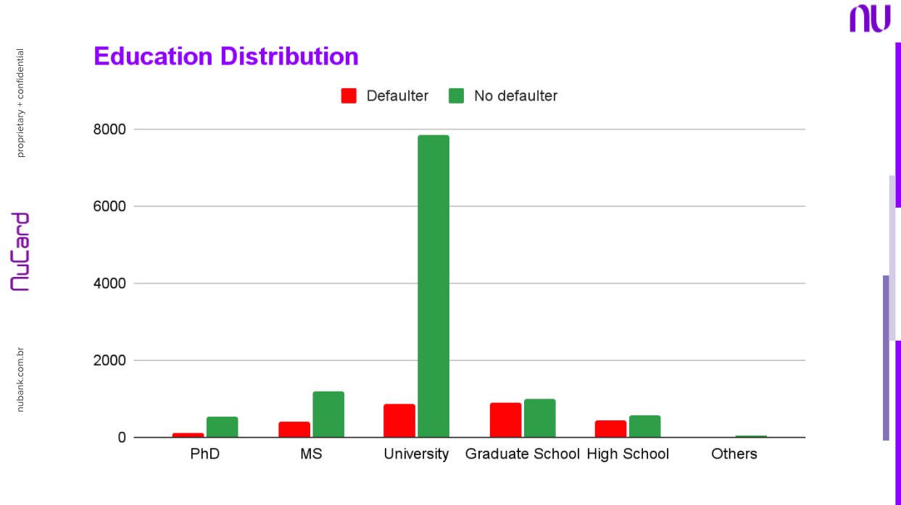

# NuCard
This repository would store all the code and relevant files (POC, training sets, metrics, etc.) regarding the credit card model

## Current Customer Metrics

#

#

#

## _One of the key features of this section would be to show the results from the Proof Of Concept which was executed before the final project proposal_
